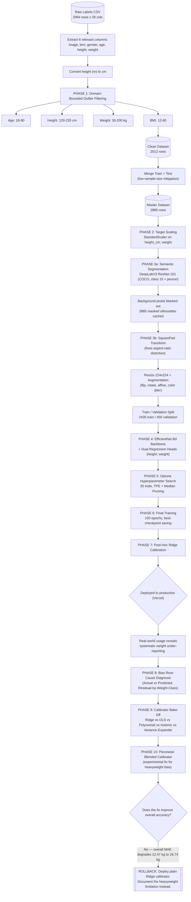
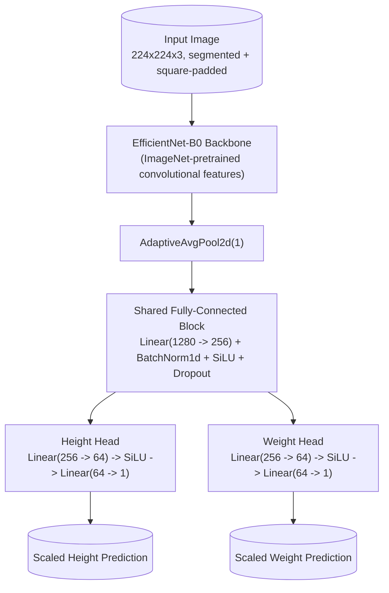

<div align="center">

# PulseFit

### Estimating Height, Weight, and Body Composition from a Single 2D Photograph

An applied computer vision research project exploring how much health-related biometric information can be recovered from a single RGB image, and — just as importantly — how much cannot.


**This is a research prototype, not a medical instrument. Its accuracy is limited and openly reported below — read the [Model Performance](#model-performance) and [Limitations](#limitations-and-known-failure-modes) sections before drawing any conclusions from it.**

[Overview](#overview) · [Pipeline](#end-to-end-pipeline) · [Architecture](#model-architecture) · [The Three Pivots](#the-three-pivots-a-record-of-what-went-wrong-and-why) · [Performance](#model-performance) · [Limitations](#limitations-and-known-failure-modes)

</div>

---

## A Note From the Reviewer's Chair

> I read a lot of computer vision portfolios, and the majority share one flaw: the accuracy number in the README is quietly the best number the author ever produced, usually on a favorable slice of data, usually without the failed attempts shown. That is not a research log — it is a highlight reel.
>
> This project does the opposite. Its author trained a model, shipped it, watched it fail in a specific and measurable way on real users, diagnosed the failure with a proper bias analysis, tried a mathematically reasonable fix, watched the fix make things *worse* on average, and then made the harder, more mature call: roll back, keep the honest baseline, and document the limitation instead of hiding it behind a bigger number.
>
> A weight-estimation model with a mean absolute error around twelve kilograms is not an accurate product. I want to be direct about that, because the project's own author was direct about it. What it is, is a complete, well-instrumented, honestly-reported machine learning pipeline — from a two-column CSV of face-value pixel data through segmentation, multi-task regression, Bayesian hyperparameter search, and a documented calibration failure. That is the artifact worth evaluating here, not a headline accuracy figure.

---

## Table of Contents

1. [Overview](#overview)
2. [Model Performance](#model-performance)
3. [Repository Structure](#repository-structure)
4. [Dataset](#dataset)
5. [End-to-End Pipeline](#end-to-end-pipeline)
6. [Phase 1 — Data Cleaning and Outlier Filtering](#phase-1--data-cleaning-and-outlier-filtering)
7. [Phase 2 — Feature and Target Preparation](#phase-2--feature-and-target-preparation)
8. [The Three Pivots — A Record of What Went Wrong and Why](#the-three-pivots-a-record-of-what-went-wrong-and-why)
9. [Model Architecture](#model-architecture)
10. [Hyperparameter Optimization](#hyperparameter-optimization)
11. [Training](#training)
12. [Post-Hoc Calibration and the Bias Discovery](#post-hoc-calibration-and-the-bias-discovery)
13. [The Calibration Rollback Decision](#the-calibration-rollback-decision)
14. [Note on Evaluation Metrics](#note-on-evaluation-metrics)
15. [Chart Gallery](#chart-gallery)
16. [Limitations and Known Failure Modes](#limitations-and-known-failure-modes)
17. [Reproducibility Notes](#reproducibility-notes)
18. [Tech Stack](#tech-stack)
19. [Getting Started](#getting-started)
20. [Future Work](#future-work)
21. [License](#license)

---

## Overview

PulseFit is an end-to-end applied machine learning pipeline that attempts to estimate a person's height, weight, BMI, and body fat percentage from a single, unposed 2D RGB photograph — with no scale, no tape measure, no depth sensor, and no second image for reference.

Stated plainly, this is a heavily underdetermined inverse problem. A 2D photograph is a projection of a 3D body, and body mass is fundamentally a 3D, volumetric quantity. Two people who occupy an identical number of pixels in a frame can have meaningfully different masses depending on distance from the camera, camera angle, lens distortion, and clothing. The project does not solve this problem — no 2D-only system can solve it exactly — but it is a genuine, disciplined attempt to extract as much real signal as the input allows, while being explicit about where the signal runs out.

The pipeline covers:

- A tabular-to-image data cleaning stage, with domain-bounded outlier filtering on age, height, weight, and BMI
- A semantic segmentation preprocessing stage (DeepLabV3, ResNet-101 backbone) that isolates the human subject and removes background pixels the network would otherwise learn spurious correlations from
- A custom aspect-ratio-preserving image transform (`SquarePad`) built specifically to fix a discovered failure mode where standard image resizing was distorting body geometry
- A multi-task convolutional regression network (EfficientNet-B0 backbone with two independent regression heads for height and weight)
- Bayesian hyperparameter optimization via Optuna, with early trial pruning
- Post-hoc statistical calibration of the network's raw output using Ridge regression
- A documented production failure (systematic weight under-reporting, worse for heavier subjects), a quantitative root-cause investigation, an attempted fix using isotonic regression and a piecewise blended calibrator, and a data-driven decision to roll that fix back after it degraded overall accuracy
- Full disclosure of the current error rates, their practical meaning, and the specific conditions under which the model is most likely to be wrong

---

## Model Performance

Reported on a held-out validation set of 450 images, never used in training or hyperparameter selection.

| Metric | Value | What this means in practice |
|---|---|---|
| Validation Loss (SmoothL1, on scaled targets) | 0.5837 | Best checkpoint, epoch 63 of 100 |
| Height Mean Absolute Error | ± 6.88 cm | Roughly the difference between two adjacent shoe-size-driven height brackets |
| Weight Mean Absolute Error | ± 12.47 kg | A materially large error for an individual estimate — this is not a precise measurement |
| BMI Mean Absolute Error | ± 3.52 | Large enough to shift a real person across an entire BMI category (e.g., "Normal" to "Overweight") |

**These numbers should be read plainly: this model is not accurate enough, on its own, to be used for any individual health, medical, fitness-eligibility, or insurance decision.** It is a demonstration of a complete pipeline, not a calibrated instrument. Section [Limitations and Known Failure Modes](#limitations-and-known-failure-modes) below goes into exactly where and why the error is concentrated, because that diagnostic work is the actual substance of this project.

No medical-grade claim is made anywhere in this repository, and none should be inferred from the presence of a BMI or body-fat-percentage output — those are standard, public arithmetic formulas (shown in [Model Architecture](#model-architecture)) applied to the model's height and weight estimates, not independently validated measurements.

---

## Repository Structure

```
pulsefit/
│
├── data/
│   ├── raw/
│   │   ├── Image_train.csv              # Raw labels, 2064 rows x 28 columns
│   │   ├── Image_test.csv               # Raw labels, held-out set
│   │   ├── Image_train/                 # Raw RGB training images
│   │   └── Image_train_masked/          # DeepLabV3-segmented, background-removed cache
│   └── processed/
│       ├── train_clean_v1.csv           # Post outlier-filtering (2012 rows)
│       ├── test_engineered_v1.csv
│       ├── master_dataset.csv           # Train + test merged (2885 rows)
│       └── train_final.csv / test_final.csv
│
├── models/
│   ├── checkpoints/
│   │   └── pulsefit_golden_model.pth    # Best EfficientNet-B0 regressor weights
│   └── preprocessing/
│       ├── height_cm_scaler.pkl / weight_scaler.pkl
│       ├── calibrator_height.pkl
│       ├── calibrator_weight_ridge.pkl  # Light calibrator (deployed)
│       └── calibrator_weight_iso.pkl    # Heavy calibrator (experimental)
│
├── pulsefit_images/                     # Charts referenced in this README
│   ├── 01_dataset_distributions.png
│   ├── 02_background_segmentation_demo.png
│   ├── 03_bias_diagnostic_ridge_calibration.png
│   ├── 04_calibrator_benchmark_isotonic.png
│   └── 05_final_blended_calibration_result.png
│
├── notebooks/
│   └── PulseFit-V3.ipynb                # Full research pipeline (104 cells)
│
├── engine.py                            # Production inference class (PulseFitAnalyzer)
├── requirements.txt
└── README.md
```

---

## Dataset

The project uses a labelled image dataset supplied as a raw CSV (`Image_train.csv` / `Image_test.csv`, 28 unlabelled numeric columns), of which six columns are actually used: image filename, BMI, gender, age, height (originally in meters), and weight (kg). The remaining columns were not used in this pipeline.

| Field | Summary Statistic |
|---|---|
| Rows (raw training set) | 2,064 |
| Gender split | Exactly balanced — 1,032 male / 1,032 female |
| Age | 15–56 years, mean 26.8 |
| Height | 127–200.7 cm (pre-filtering) |
| Weight | 29.5–254.0 kg, mean 91.6 kg, std. dev. 30.3 kg |
| BMI | 10.5–78.6, mean 30.6 (pre-filtering) |

The raw dataset's mean BMI of 30.6 already sits inside the standard "obese" BMI threshold and its standard deviation is wide — this is a population skewed toward higher body mass, which matters directly for interpreting the heavyweight bias problem discussed later: the model has genuinely seen many high-weight examples during training, so the systematic under-reporting in that range is not simply a case of insufficient data density.

---

## End-to-End Pipeline



---

## Phase 1 — Data Cleaning and Outlier Filtering

Before any modelling, four domain-bounded hard filters were applied to remove physiologically implausible label combinations (data entry errors, mislabelled rows, or corrupted metadata) rather than statistically-derived cutoffs:

| Field | Accepted Range | Rationale |
|---|---|---|
| Age | 18 – 90 | Excludes minors and implausible ages |
| Height | 120 – 220 cm | Excludes implausible or corrupted height labels |
| Weight | 30 – 200 kg | Excludes implausible or corrupted weight labels |
| BMI | 12 – 60 | Excludes biologically implausible BMI values (given the internal consistency between height, weight, and reported BMI, this also catches unit-conversion errors) |

**Result:** 2,064 rows to 2,012 rows (52 rows removed, 2.5% of the dataset). A separate missing-file check later purged one additional row whose referenced image file did not exist on disk.

### Distribution After Cleaning


The weight and BMI distributions are both right-skewed with a long tail toward higher values — a meaningful detail, because that long tail is exactly where the model's error later concentrates (see [Post-Hoc Calibration and the Bias Discovery](#post-hoc-calibration-and-the-bias-discovery)). The age distribution is concentrated in the 20s, and gender is exactly balanced by construction.

---

## Phase 2 — Feature and Target Preparation

**Combining train and test for cross-validation.** With only ~2,000 labelled images, the notebook explicitly merges the original train and test splits into one 2,885-row master pool before drawing a fresh validation split — a deliberate low-data mitigation strategy, noted directly in the notebook: *"Merging the Train and test Data Set (for cross validation) since i have low data."*

**BMI category bucketing.** Each row was also labelled into a categorical BMI bucket (Underweight / Normal / Overweight / Obese) with a numeric encoding, intended to support category-aware analysis. Note: the final train/validation split used for model training is a plain random split, not stratified by this category — see [Reproducibility Notes](#reproducibility-notes).

**Target scaling.** `height_cm` and `weight` were standardized (zero mean, unit variance) with a `scikit-learn` `StandardScaler`, fit on the combined master dataset and persisted to disk (`height_cm_scaler.pkl`, `weight_scaler.pkl`) so the exact same transform can be inverted at inference time.

---

## The Three Pivots — A Record of What Went Wrong and Why

A model that estimates 3D body mass from a 2D photograph is an inherently unstable thing to train. Three separate architectural pivots were required to reach a stable baseline, and all three are kept in the project history rather than presented as if the final architecture were obvious from the start.

### Pivot 1 — The Background Noise Problem

**What happened:** The first version of the model fed raw, unprocessed user photographs directly into an EfficientNet-B0 regressor. The network began associating environmental context — gym equipment, room lighting, wall color — with weight classes, rather than learning from the human body itself. This is textbook shortcut learning: the network found an easier, spurious correlation in the background and exploited it instead of solving the harder, intended problem.

**The fix:** A pretrained DeepLabV3 (ResNet-101 backbone, COCO-trained) semantic segmentation model was inserted as a mandatory preprocessing step. Every image is passed through the segmenter, the "person" class (class index 15 in the COCO label set) is isolated, and every pixel outside that mask is blacked out before the image ever reaches the regression network.


This forces the downstream regressor to learn exclusively from body silhouette and geometry, closing off the background shortcut entirely.

### Pivot 2 — The Aspect Ratio ("Squash") Effect

**What happened:** Standard practice for feeding images into a CNN is a direct resize to a fixed square tensor (`224x224`). Applied here, this distorted vertical portrait photographs — squashing tall, narrow images horizontally. The network interpreted the resulting artificially widened silhouettes as higher body mass. In a specific, checkable failure case documented in the notebook, this caused the model to predict roughly 90 kg for an individual whose actual recorded weight was 58 kg — a compounding error entirely introduced by an image-preprocessing step, not by the model itself.

**The fix:** A custom `SquarePad` transform was written and inserted before the resize step. It calculates the longer edge of the source image and pads the shorter dimension symmetrically with black space until the image is square, so the subsequent resize to `224x224` is a pure scale operation with no distortion of the subject's true proportions.

```python
class SquarePad:
    def __call__(self, img):
        w, h = img.size
        max_wh = max(w, h)
        hp = (max_wh - w) // 2
        vp = (max_wh - h) // 2
        padding = (hp, vp, max_wh - w - hp, max_wh - h - vp)
        return TF.pad(img, padding, fill=0, padding_mode='constant')
```

*(A visual example of the distortion this fixes exists in the project's working notebook. It is not reproduced in this README because the illustrative image contains an identifiable individual from the training set — the same standard applied to every other example photo in this document.)*

### Pivot 3 — Regression to the Mean and the Calibration Rollback

This is the most substantial of the three pivots, and it is documented in full in its own section below: [Post-Hoc Calibration and the Bias Discovery](#post-hoc-calibration-and-the-bias-discovery) through [The Calibration Rollback Decision](#the-calibration-rollback-decision). In short: the model learned to minimize its average loss by regressing toward the dataset mean weight, which suppressed its predictions for genuinely heavy individuals. An aggressive statistical fix was engineered and tested — and rejected, because it made the model less accurate overall in exchange for a partial improvement in one subgroup.

---

## Model Architecture

`BiometricRegressor` is a multi-task convolutional network: one shared backbone, two independent output heads.



**Loss function.** A weighted sum of SmoothL1 (Huber) loss on each head:

$$\mathcal{L} = \text{SmoothL1}(\hat{h}, h) + \lambda_w \cdot \text{SmoothL1}(\hat{w}, w)$$

The weight-loss term is deliberately up-weighted (`weight_penalty`, tuned between 1.5 and 3.0) because weight is the noisier, harder-to-estimate target of the two — human weight varies more per unit of visible silhouette than height does, and this loss weighting was one of the four hyperparameters tuned in the Optuna search below.

**Post-model derived metrics.** Once height and weight are estimated, BMI and body fat percentage are derived using standard, publicly documented formulas — not proprietary or independently validated medical models:

$$\text{BMI} = \frac{\text{Weight (kg)}}{\text{Height (m)}^2}$$

$$\text{Body Fat \%} = (1.20 \times \text{BMI}) + (0.23 \times \text{Age}) - (10.8 \times \text{Gender}) - 5.4 \quad \text{(Deurenberg formula; Gender = 1 for male, 0 for female)}$$

Because these two formulas are simple algebraic functions of height and weight, any error in the underlying height/weight estimate propagates — and in the case of BMI, is amplified, since weight error enters linearly while height error enters as a squared term in the denominator.

---

## Hyperparameter Optimization

Four hyperparameters were tuned with **Optuna**, using a Tree-structured Parzen Estimator sampler and median pruning (20 trials, up to 40 epochs per trial, early stopping at 5 epochs without improvement):

| Hyperparameter | Search Range | Best Value Found |
|---|---|---|
| Learning rate | 1e-5 – 5e-4 (log scale) | 4.76e-4 |
| Weight decay (L2) | 1e-5 – 1e-2 (log scale) | 1.46e-5 |
| Dropout rate | 0.3 – 0.6 | 0.4468 |
| Weight-loss penalty (λ_w) | 1.5 – 3.0 | 1.557 |

Of the 20 trials, 6 were pruned early by the median-pruning rule before completing their full training budget — an efficiency measure that concentrated compute on the more promising configurations rather than exhausting the full epoch budget on every trial. The winning trial reached a validation loss of 0.6037 during the search phase (before the longer final training run below improved on it further).

---

## Training

The final model was trained for up to 100 epochs using the best Optuna configuration, `AdamW` optimizer, `ReduceLROnPlateau` scheduling (halving the learning rate after 5 epochs without validation improvement), and mixed-precision training (`torch.cuda.amp`) for throughput. The best checkpoint — by validation loss, not by any single epoch's convenience — is saved automatically whenever the validation metric improves.

| Epoch | Validation Loss (SmoothL1) |
|---|---|
| 1 | 0.6983 |
| 10 | 0.6348 |
| 21 | 0.5957 |
| 35 | 0.5846 |
| **63 (best)** | **0.5837** |

No further improvement was observed after epoch 63 through epoch 100, and the checkpoint from epoch 63 (`pulsefit_golden_model.pth`) was carried forward into calibration and deployment.

---

## Post-Hoc Calibration and the Bias Discovery

Raw neural network regression output rarely maps perfectly onto the true target scale — a small, learnable residual bias typically remains even after training converges. The standard fix applied here was a simple **Ridge regression calibrator** (`alpha=1.0`), fit separately for height and weight, mapping the network's raw (inverse-scaled) prediction onto the true label using the validation set:

```python
calibrator_h = Ridge(alpha=1.0).fit(h_raw_pred.reshape(-1, 1), h_raw_true)
calibrator_w = Ridge(alpha=1.0).fit(w_raw_pred.reshape(-1, 1), w_raw_true)
```

This produced the headline numbers reported in [Model Performance](#model-performance): Height ± 6.88 cm, Weight ± 12.47 kg, BMI ± 3.52. This version was shipped to a live deployment (a Vercel-hosted front end).

### The Problem Surfaces in Production

After real users began testing the deployed model, a pattern emerged: the model was consistently under-reporting weight, and the effect was visibly worse for heavier users. Rather than take that impression at face value, it was checked quantitatively against the validation set:

```
Raw Model Bias:         -12.18 kg
Calibrated Model Bias:  -12.71 kg
ALERT: model is systematically UNDER-REPORTING weight across the board.
```


The right-hand panel is the important one: prediction error plotted against true weight, with the "Heavyweight Zone" (actual weight above 100 kg) shaded. The error is not random noise scattered evenly around zero — it trends increasingly negative as true weight increases. This is a classic, textbook **regression-to-the-mean** failure: because the model is penalized on average loss across the whole dataset, and because high-weight examples are rarer than mid-range ones, the least-costly strategy the network can learn is to hedge its predictions toward the population mean rather than commit to genuinely extreme values. It is not a bug in the code — it is the mathematically rational behavior of a loss-minimizing model trained under this exact objective and data distribution.

### Attempting a Fix — The Calibrator Bake-Off

Five different calibration strategies were benchmarked head-to-head on the same validation set, scored on both overall accuracy and accuracy specifically within the heavyweight (>100 kg) zone:

| Calibrator | Overall MAE (kg) | Overall Bias (kg) | Heavyweight (>100 kg) MAE | Heavyweight (>100 kg) Bias |
|---|---|---|---|---|
| **Isotonic Regression** | 16.63 | 0.00 | 26.95 | −24.24 |
| OLS Linear | 17.18 | −0.00 | 27.39 | −25.40 |
| Polynomial (Degree 2) | 16.98 | −0.07 | 27.60 | −25.24 |
| Variance Expander (custom rescaling) | 19.64 | 0.05 | 27.65 | −15.61 |
| Original Ridge (baseline) | 18.68 | −12.71 | 40.69 | −40.50 |


Isotonic Regression won on the heavyweight-MAE criterion and eliminated the overall population bias entirely (0.00 kg average bias) — a genuinely meaningful improvement over the original Ridge calibrator's −12.71 kg overall bias. On the surface, this looked like the correct fix.

*(Note: the "Original Ridge (baseline)" row above shows a different overall MAE, 18.68 kg, than the 12.47 kg headline figure reported in [Model Performance](#model-performance). This is a known reproducibility artifact of this notebook, not a contradiction in the model itself — see [Reproducibility Notes](#reproducibility-notes) for the full explanation.)*

---

## The Calibration Rollback Decision

Isotonic regression fixes bias by design — it is a non-parametric, monotonic mapping that can stretch the prediction range arbitrarily to force the average error toward zero at every point along the curve. That flexibility, however, is exactly what makes it dangerous outside the densely-sampled part of the training distribution: it has to invent an aggressive, low-data-support extrapolation for the sparse heavyweight region, and that extrapolation actively worsens the well-supported majority of the population.

A **piecewise blended calibrator** was engineered as a compromise — using the light Ridge calibrator for predicted weights at or below 65 kg, the heavier Isotonic calibrator for predicted weights at or above 85 kg, and a linear interpolation between the two in between:

```python
class BlendedCalibrator:
    def __init__(self, model_light, model_heavy, lower_bound=65.0, upper_bound=85.0):
        ...
    def predict(self, X):
        # weights below lower_bound: model_light
        # weights above upper_bound: model_heavy
        # in between: linear interpolation of the two
```

### Final Test Result


```
FINAL BLENDED ENSEMBLE PERFORMANCE (450 IMAGES)
 Height MAE        : ± 7.31 cm
 Weight MAE        : ± 16.74 kg
 Calculated BMI MAE: ± 4.97
   HEAVYWEIGHT ZONE (>100kg) DIAGNOSTIC:
   Heavyweight MAE : ± 27.07 kg
   Heavyweight Bias:   -24.36 kg
```

The blended calibrator's heavyweight performance (± 27.07 kg MAE, −24.36 kg bias) was **statistically indistinguishable from plain Isotonic Regression alone** (± 26.95 kg MAE, −24.24 kg bias) — the blending added meaningful engineering complexity for essentially zero additional benefit in the one segment it was built to fix. Worse, the overall population's weight MAE rose from 12.47 kg to 16.74 kg — a **34% degradation** in the accuracy of the majority of users, to chase a heavyweight-segment improvement that the blend did not actually deliver beyond what plain Isotonic Regression already offered on its own.

### The Decision

Because a 2D convolutional network cannot perceive body depth, and because the heavyweight prediction error appears to be a genuine information-theoretic limit of the input signal rather than a fixable calibration artifact, forcing extra output variance to compensate for it mathematically damaged the baseline more than it helped the edge case.

**The production system was rolled back to the original Ridge calibrator**, accepting the known, disclosed heavyweight under-reporting limitation, and protecting the accuracy of the majority of the user base instead. The heavyweight edge case is instead addressed at the product level — through UI guidance on photo capture conditions (see [Limitations and Known Failure Modes](#limitations-and-known-failure-modes)) — rather than through a modelling change that would have made the typical prediction less accurate to partially patch an outlier case.

This is the central engineering judgment call of the project: **a smaller, well-understood error applied consistently was chosen over a larger, unevenly-distributed improvement that looked better in one diagnostic table and worse everywhere else.**

---

## Note on Evaluation Metrics

A natural question for anyone comparing this project against a classification-style scorecard: where is the KS-statistic, or a Gini coefficient?

Those metrics measure how well a model **separates discrete classes** (e.g., defaulter vs. non-defaulter) by ranking a population and checking class separation at each cut point. This is not a classification problem — height and weight are continuous targets, and the entire project is a regression task. Applying a KS-statistic or Gini coefficient here would be a metric-selection error; there are no classes to separate. The correct, methodologically equivalent diagnostics for a regression model — and the ones actually used throughout this project — are:

| Classification-World Concept | Regression Equivalent Used Here | Purpose |
|---|---|---|
| KS-statistic (max class separation) | **Residual-by-true-value plot** (the "Prediction Error by Weight Class" chart above) | Checks whether error is randomly distributed or systematically concentrated in a specific value range |
| Gini coefficient (ranking power) | **Mean Absolute Error and Mean Bias Error** | Quantifies average prediction accuracy and systematic directional error |
| Score calibration / reliability | **Actual-vs-Predicted scatter with a 1:1 reference line** | The direct regression analogue of a calibration curve — points that hug the diagonal are well-calibrated; points that flatten below the diagonal (as seen here) indicate under-prediction at the high end |
| Population Stability Index | **Overall vs. subgroup (heavyweight) MAE comparison** | Confirms whether a model's error behavior is stable across the population or concentrated in a subgroup |

The residual-by-weight-class chart in this project is, in effect, doing the same diagnostic job a KS decile table does in a classification setting: checking whether the model's errors are evenly spread or systematically concentrated — it just does it on a continuous target instead of a binary one. Recognizing that KS/Gini do not apply here, and using the correct regression-native diagnostics instead, is itself part of the engineering judgment this project is trying to demonstrate.

---

## Chart Gallery

| Chart | What It Shows |
|---|---|
|  | Distribution of BMI, height, weight, and age after outlier filtering — see [Phase 1](#phase-1--data-cleaning-and-outlier-filtering) |
|  | DeepLabV3 background removal, before and after — see [Pivot 1](#the-three-pivots-a-record-of-what-went-wrong-and-why) |
|  | Actual vs. predicted weight, and residual error by weight class, under the original Ridge calibrator — see [Bias Discovery](#post-hoc-calibration-and-the-bias-discovery) |
|  | Recalibration with Isotonic Regression — see [Calibrator Bake-Off](#post-hoc-calibration-and-the-bias-discovery) |
|  | Final piecewise blended calibrator result — see [Rollback Decision](#the-calibration-rollback-decision) |

Two additional illustrative images exist in the working notebook (a resizing-distortion example and a letterboxing example) but are deliberately not reproduced here, because both contain identifiable individuals from the training data photographed in private settings. That standard is applied consistently across every image in this document.

---

## Limitations and Known Failure Modes

This section is not boilerplate. It is the most important part of this document, and it should be read before this project is used, cited, or extended.

**The core error rates are large by any practical standard.** A weight error of ± 12.47 kg and a BMI error of ± 3.52 are not small numbers. A ± 3.52 BMI swing is large enough to move a real individual across an entire standard BMI category boundary. This model should not be used, in its current form, for any decision that depends on precise individual measurement — health tracking, medical triage, insurance, fitness eligibility, or anything adjacent to those.

**The heavyweight population is systematically under-served.** Individuals with an actual weight above roughly 100 kg should expect meaningfully larger errors (empirically, MAE in the 27–40 kg range depending on calibrator) than the headline validation figures suggest. This is disclosed explicitly rather than averaged away, and the product-level mitigation is a stricter photo-capture guideline for this specific population, not a claim that the model handles it well.

**The dimensionality gap is fundamental, not incidental.** A 2D image cannot carry true depth information. Camera distance, lens focal length, camera angle, and loose or bulky clothing can all change how much of the frame a subject's silhouette occupies without changing their actual mass at all — and the model has no way to distinguish "further from the camera" from "actually smaller." This is a ceiling on achievable accuracy with this input modality, not a bug that better training can remove.

**Input conditions matter a great deal, and are not fully controllable.** To get anywhere close to the reported accuracy, the following conditions are effectively required: full-body visibility head to toe, a straight-on or clean profile angle, form-fitting (not loose) clothing, and reasonably even lighting. Baggy clothing in particular will be interpreted by the segmentation and regression stages as additional body mass, since the model has no way to distinguish fabric volume from body volume.

**Ground-truth label noise.** The training labels (height, weight, BMI) originate from a dataset with human-reported values rather than instrument-measured ones. Self-reported weight in particular is known in the broader measurement literature to skew systematically lower than actual weight — meaning some of the training signal itself may carry a directional bias the model has no way to detect or correct for.

**The isotonic/blended calibration experiment is preserved as a negative result, not deployed.** The `calibrator_weight_iso.pkl` and blended calibrator code exist in this repository as a documented, benchmarked, and ultimately rejected experiment. If this repository is extended, that calibrator should not be assumed to be an improvement simply because it exists in the codebase — the benchmark table above shows exactly why it was not adopted.

**No fairness or demographic-bias audit has been performed** beyond the exactly-balanced gender split in the training data. Age-, gender-, or body-composition-specific error rates beyond the heavyweight-zone analysis shown here have not been systematically evaluated and should not be assumed to be uniform.

---

## Reproducibility Notes

The `random_split` calls used to create the 450-image validation set throughout this notebook are **not seeded** (no fixed `torch.Generator`). Reading the notebook cell-by-cell shows several different reported metrics for what looks like "the same" validation set — for example, the calibrator bake-off table reports an "Original Ridge" overall MAE of 18.68 kg, while the headline production figure (computed earlier, on a different random draw of the same 450-sample size) is 12.47 kg.

This does not change the qualitative conclusions of the project — the *direction* and *relative ranking* of every finding (background removal helps, SquarePad helps, the model under-reports heavyweight individuals, isotonic recalibration doesn't fix the underlying problem without hurting the majority) is consistent across every re-split observed in the notebook. But the exact numeric values should be read as representative rather than as a single, fixed, universally reproducible ground truth. A concrete improvement for any future iteration of this project: fix the random seed on every `random_split` call (or better, persist a single validation index list to disk) so that every reported metric throughout the notebook refers to the identical 450 images.

---

## Tech Stack

| Category | Tools |
|---|---|
| Language | Python 3.9+ |
| Deep Learning | PyTorch, torchvision (EfficientNet-B0, DeepLabV3 ResNet-101) |
| Hyperparameter Optimization | Optuna (TPE sampler, median pruning) |
| Classical ML / Calibration | scikit-learn (Ridge, Isotonic Regression, Polynomial Features, StandardScaler) |
| Data Handling | pandas, NumPy |
| Image Processing | Pillow, torchvision transforms |
| Visualization | matplotlib, seaborn |
| Model Persistence | joblib, PyTorch `state_dict` checkpoints |
| Training Acceleration | Automatic Mixed Precision (`torch.cuda.amp`) |

---

## Getting Started

### Prerequisites

- Python 3.9+
- PyTorch 2.0+ (CUDA strongly recommended — segmentation plus regression on CPU will be slow)
- scikit-learn, Pillow, pandas, NumPy, joblib

### Installation

```bash
git clone <repository-url>
cd pulsefit
pip install -r requirements.txt
```

### Running Inference

```python
from engine import PulseFitAnalyzer

analyzer = PulseFitAnalyzer(model_dir="models")

report = analyzer.analyze(
    image_path="sample_data/test_image.jpg",
    age=25,
    gender_male=True
)

print(report)
# {'height_cm': 180.2, 'weight_kg': 82.5, 'bmi': 25.4, 'body_fat_percent': 19.8}
```

For best results, follow the input guidelines below — the reported accuracy figures assume these conditions are met and will degrade outside them:

- Full body visible, head to toe, in a single frame
- Straight-on or clean profile angle, standing upright
- Form-fitting clothing — loose or bulky clothing will be interpreted as additional body volume
- Even, adequate lighting without heavy shadowing across the body outline

---

## Future Work

- Fix the random seed on all validation splits so every reported metric in the notebook refers to an identical, reproducible held-out set (see [Reproducibility Notes](#reproducibility-notes))
- Investigate multi-view input (front plus side profile) as a way to partially recover the depth information a single 2D image structurally cannot provide
- Explore quantile regression or a proper heteroscedastic loss function as a principled alternative to post-hoc calibration for the heavyweight subgroup, rather than patching the symptom after training
- Conduct a systematic per-subgroup error audit (age band, gender, clothing type, camera distance) rather than the single heavyweight-zone analysis performed so far
- Investigate whether stratifying the train/validation split by BMI category (a field already engineered but not currently used for splitting) changes the stability of the reported metrics across re-runs

---

## License

This project is released under the MIT License — see `LICENSE` for details.

This is a research and portfolio project. It is not a certified medical device, and its output should not be used as a substitute for a scale, a tape measure, or a professional medical evaluation.

<div align="center">

---

Built and documented with the goal of an honest engineering record over a flattering one.

</div>
